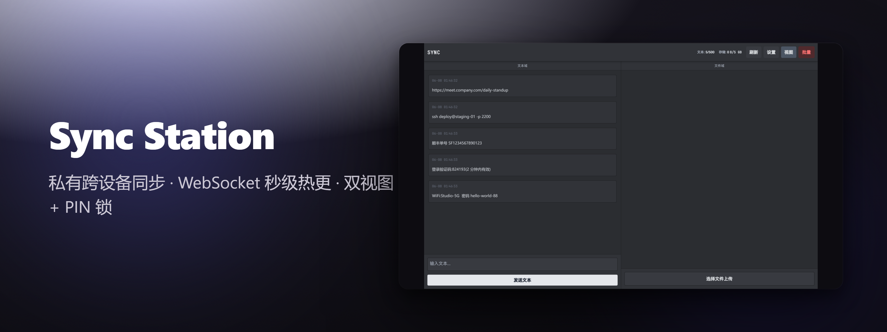
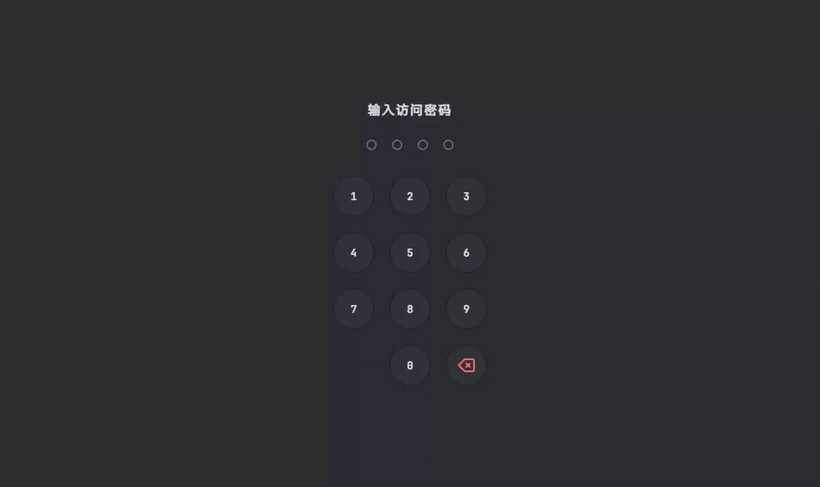
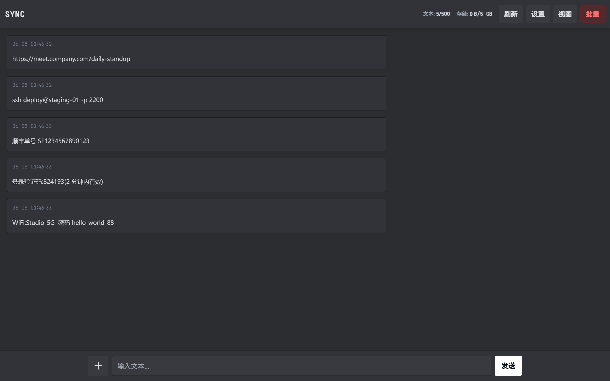
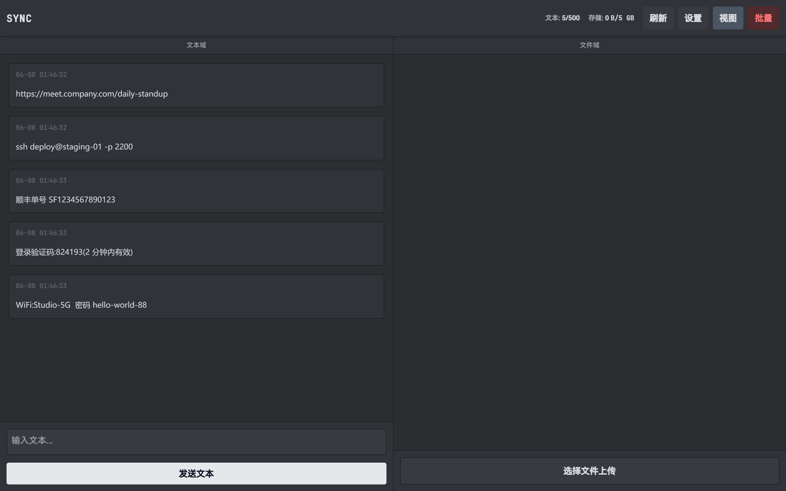
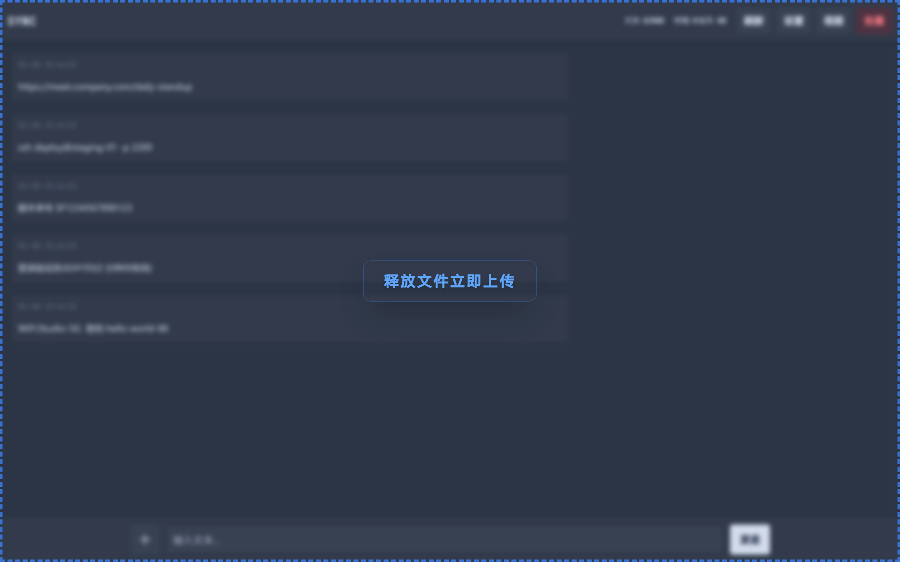
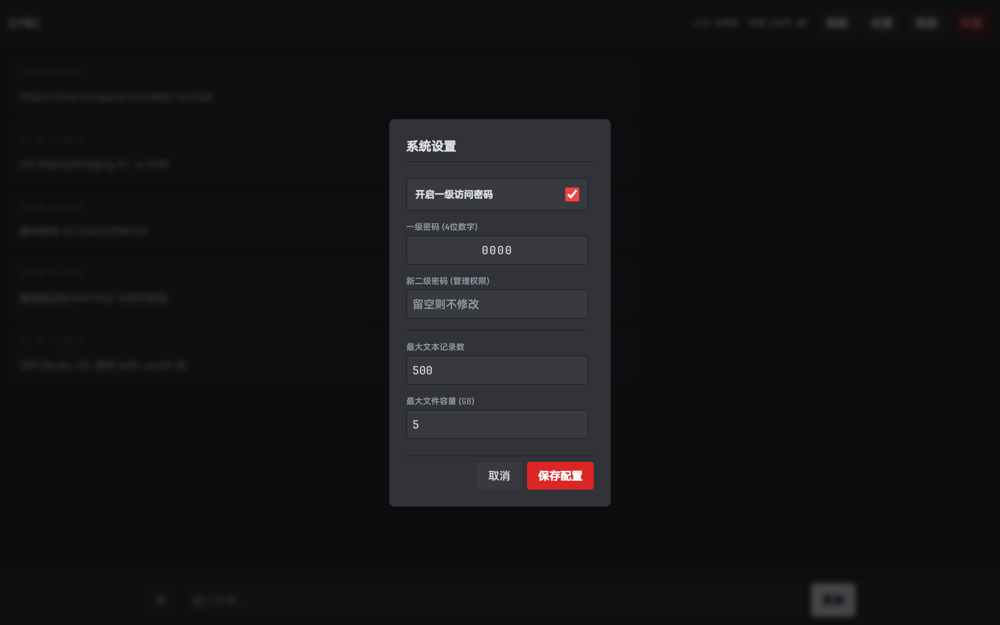
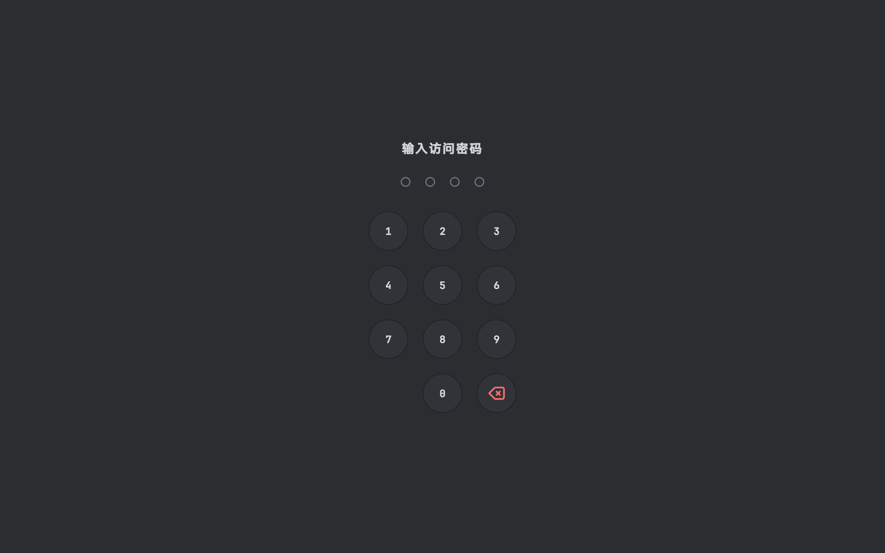

<div align="center">



# Sync Station

**你的私人剪贴板，无处不在。**

一个私有、自托管的中转站，基于 WebSocket 在你所有设备间热同步文本和文件 —— 告别社交软件转一圈，告别账号来回切换。

[](https://github.com/Cohenjikan/sync-station/blob/main/LICENSE)
[](https://nodejs.org)
[](https://socket.io)
[](https://github.com/Cohenjikan/sync-station)
[](https://github.com/Cohenjikan/sync-station/stargazers)

[English](README.en.md) · **中文**

</div>

<div align="center">



<sub>在一端粘贴或拖入，另一端几乎瞬间出现。</sub>

</div>

---

## 这是什么 🛰️

你是不是也这样：手机上复制一段文字，想发到电脑上，结果先发给「文件传输助手」，再切到电脑打开聊天软件复制出来。或者给自己发一封邮件，只为了传一个文件。

**Sync Station 把这件事变简单。** 它是一个跑在你自己 VPS 上的轻量中转站：一端粘贴或拖入文本、文件，几乎瞬间出现在你所有打开页面的设备上。数据只在**你自己的服务器**上流转，不经过任何第三方云。

> 一句话：**在一台设备放下，在下一台设备拿起。**

适合谁：在手机、笔记本、公司电脑、家里电脑之间来回倒腾内容，受够了用聊天软件和自己给自己发邮件当「中转」的人。你愿意自己跑一条 `curl` 命令把它部署到一台 Debian/Ubuntu 机器上，想要一个**自己掌控**的私有桥，而不是又一个云服务。

---

## 为什么用它 ✨

| | |
| :-- | :-- |
| 🔒 **真正自托管，单租户** | 数据活在**你自己的 VPS** 上，不进第三方云。这正是它存在的意义 —— 替代「往聊天软件里粘」。 |
| ⚡ **一条命令开箱即用** | `lazyRun.sh` 不只是装应用：Node 20 + PM2 守护、Nginx 反代、Let's Encrypt SSL、可选 BBR 提速、防火墙排错提示，外加一个全局 `syncstation` CLI。 |
| 🪟 **一份数据，两种视图** | 分屏视图（文本 / 文件各占一栏）和合并视图（聊天流体验），实时切换，看你当下顺手哪种。 |
| 📎 **拖拽 + 粘贴双通道上传** | 桌面端整窗拖拽落文件，或者直接 Ctrl/Cmd-V 把剪贴板里的文件甩进去。哪个快用哪个。 |
| 🪶 **极简、好审计的栈** | express + socket.io + multer，整个服务端就是一个约 280 行的文件，想看明白发生了什么不费劲。 |

---

## 核心特性 🧩

### ⚡ WebSocket 实时热同步
在一端粘贴或拖入，无需刷新就会出现在其它设备上。服务端每次状态变更都通过 socket.io 向已认证的连接推送 `sync_state`，客户端监听该事件即时渲染。延迟取决于网络往返 —— 网络通畅时基本是**亚秒级的即时推送**。

<div align="center"></div>

### 🪟 双模 UI：分屏视图 + 合并聊天流
整理内容时用分屏视图，文本和文件各归各栏；只想要一条滚动的流时，切到合并视图，像聊天一样一条接一条。两种视图读的是同一份共享状态，一键实时切换。

<div align="center"></div>

### 📎 拖拽与剪贴板粘贴上传
传文件，怎么快怎么来：把文件拖到窗口上（带全屏拖拽蒙层提示），或者直接 `Ctrl/Cmd-V` 粘贴剪贴板里的文件。前端乐观更新 —— 发出去的条目立刻带着一个 pending 转圈出现，服务端确认后落定。

<div align="center"></div>

### 🗂️ 带上限的临时存储池，超额自动淘汰最旧
当临时草稿区用，不怕塞满硬盘。文件按时间戳排序，一旦总体积超过上限就从最旧的开始自动删除。默认上限 5GB，可在管理面板里改。

<div align="center"></div>

### 🧠 乐观前端 + 内存态文本
发出的文本立刻显示，体感顺滑；文本历史保存在服务端内存的数组里（按上限裁剪），不去反复砸硬盘。

> ⚠️ 注意：**文件是会落盘的** —— multer 把上传写到 `uploads/` 目录。只有**文本历史和文件索引**是纯内存的。

### 💾 配置持久化到 config.json
PIN 码、管理员密码和各项上限会写入 `config.json`，重启和更新后自动恢复，不用重新配。CLI 的 `update` 会在不清空配置的前提下重启服务。

### 🔐 两层访问控制（4 位 PIN + 管理员密码）
日常访问用一个仿锁屏的 4 位 PIN 拦门，设备记忆，下次免输；核心设置另用一个独立的管理员密码守住。**改 PIN 会把所有在线设备踢下线、强制重新认证。**

> ⚠️ 这是一道「把随手访客挡在门外」的轻量门禁，**不是强认证**。详见下方 [诚实的取舍](#诚实的取舍-)。

### 🚀 一键 VPS 部署 + 管理 CLI
从一台裸 Debian/Ubuntu 机器，一条 `curl` 管道直达 HTTPS 站点，之后用简单命令管理它。`lazyRun.sh` 会装好 Node 20、PM2、Nginx 反代和 Certbot/Let's Encrypt SSL、可选 BBR，并写入一个全局 `syncstation` CLI。

---

## 快速开始 🚀

> 准备一台干净的 **Debian/Ubuntu** 服务器。

### 方案 A：一键完整部署（推荐）

一条命令搞定：环境依赖、源码拉取、PM2 进程守护，并按提示可选地配置 Nginx 反向代理与 Let's Encrypt SSL。脚本会交互式询问是否开启 BBR、是否配置域名 HTTPS。

> 配置 HTTPS 前，请先把域名的 A 记录解析到服务器 IP。

```bash
bash <(curl -L https://raw.githubusercontent.com/Cohenjikan/sync-station/refs/heads/main/lazyRun.sh)
```

部署完成后用浏览器打开你的域名（或 `http://<服务器IP>:3000`），用默认凭证进入，然后**立即去设置面板改掉**。

### 方案 B：手动部署

如果你用的不是 Debian 系系统，或想完全掌控环境：

**环境依赖：**
- **Node.js**（推荐 v20.x LTS 或以上）
- **Git**
- **PM2**（Node.js 进程守护）
- *(可选)* **Nginx & Certbot**（配域名反代和 HTTPS 用）

**步骤：**

```bash
# 1. 拉取源码
git clone https://github.com/Cohenjikan/sync-station.git /opt/syncstation
cd /opt/syncstation

# 2. 安装依赖
npm install

# 3. 安装 PM2 并启动
npm install -g pm2
pm2 start server.js --name "syncstation"
pm2 save
pm2 startup
```

> **注意：** 纯手动部署**不会**生成全局 `syncstation` CLI。请用标准 PM2 指令管理（如 `pm2 logs syncstation` / `pm2 restart syncstation`）。服务默认监听 `http://127.0.0.1:3000`，如需域名访问请自行配置反向代理。

### 本地试跑

```bash
git clone https://github.com/Cohenjikan/sync-station.git
cd sync-station
npm install
npm start
# 打开 http://localhost:3000
```

### 默认凭证

| | |
| :-- | :-- |
| 访问 PIN | `0000` |
| 管理员密码 | `admin` |

> 🚨 **部署后请立即进入网页设置面板修改这两项。** 默认凭证是公开的。

---

## 命令行工具 (CLI) 🛠️

完整部署会自动注入全局 `syncstation` 管理指令。

| 指令 | 说明 |
| :--- | :--- |
| `syncstation start` | 启动进程守护 |
| `syncstation stop` | 停止进程 |
| `syncstation restart` | 重启进程 |
| `syncstation status` | 查看运行状态与资源占用 |
| `syncstation logs` | 打印实时运行日志 |
| `syncstation update` | 拉取最新版本并重启（保留配置） |
| `syncstation reset` | 恢复出厂（清空所有文件、文本记录与自定义密码） |
| `syncstation uninstall` | 彻底卸载并清理所有关联文件 |

---

## 工作原理 ⚙️

```
设备 A ─┐                              ┌─ 设备 B
设备 …  ─┼── WebSocket (socket.io) ────┼─ 设备 …
设备 N ─┘             │                └─ 设备 N
                      ▼
          你的 VPS（Node + Express）
          ├─ 文本历史  → 内存数组（按上限裁剪）
          ├─ 文件索引  → 内存
          └─ 文件实体  → uploads/（落盘，超额淘汰最旧）
                      ▲
        Nginx 反代 + Let's Encrypt SSL（可选）
```

**技术栈：** Node.js · Express · Socket.IO · Multer。整个服务端就是一个约 280 行的 `server.js`。

---

## 诚实的取舍 ⚖️

我们把它当作**私有部署里的一道轻量门禁**来设计，而不是零信任安全产品。请清楚以下事实再决定怎么用：

- **不是零信任安全。** PIN、管理员密码和配置都以**明文**存在 `config.json` 里。默认凭证是 `0000` / `admin` —— **请部署后立刻改掉。**
- **文件下载会把 PIN 拼进 URL 查询串**（`?pin=...`），因此 PIN 可能泄漏进服务器日志、代理日志和浏览器历史。把它当作「挡住随手访客」的门禁，而非强认证。
- **PIN / 管理员密码没有限流或锁定**，4 位 PIN 只有 1 万种组合。藏在私有域名后够用，公开暴露则偏弱。
- **存储是单一共享的，不区分用户或设备。** 所有知道 PIN 的人看到、也能删同一份文本和文件。它是一座共享的桥，不是各自独立的信箱。
- **没有消息分线程、没有按设备的身份、没有端到端加密。** 合并视图和分屏视图读的是同一份共享状态。
- **移动端适配仅到视口层面。** `<meta>` 设了 `viewport-fit=cover`，但并未真正写入 `env(safe-area-inset-*)` 的 CSS 规则，所以刘海 / 安全区处理基本上只是名义上的。
- **明文传输（除非你配了 HTTPS）。** 不走方案 A 的 Nginx + Let's Encrypt，流量就是明文。请务必配上 HTTPS。

---

## 截图 📸

| 锁屏 PIN 输入 | 分屏视图 | 合并聊天流 |
| :--: | :--: | :--: |
|  |  |  |

---

## 贡献 🤝

欢迎 Issue 和 PR。这是个刻意保持小巧的项目 —— 改动请尽量贴合「轻量、好审计」的初衷。

## 许可证 📄

[MIT](LICENSE) © Cohen & Louie

<div align="center">
<sub>用聊天软件给自己传文件的日子，该结束了。 ⭐ 如果它帮到你，点个 Star。</sub>
</div>
